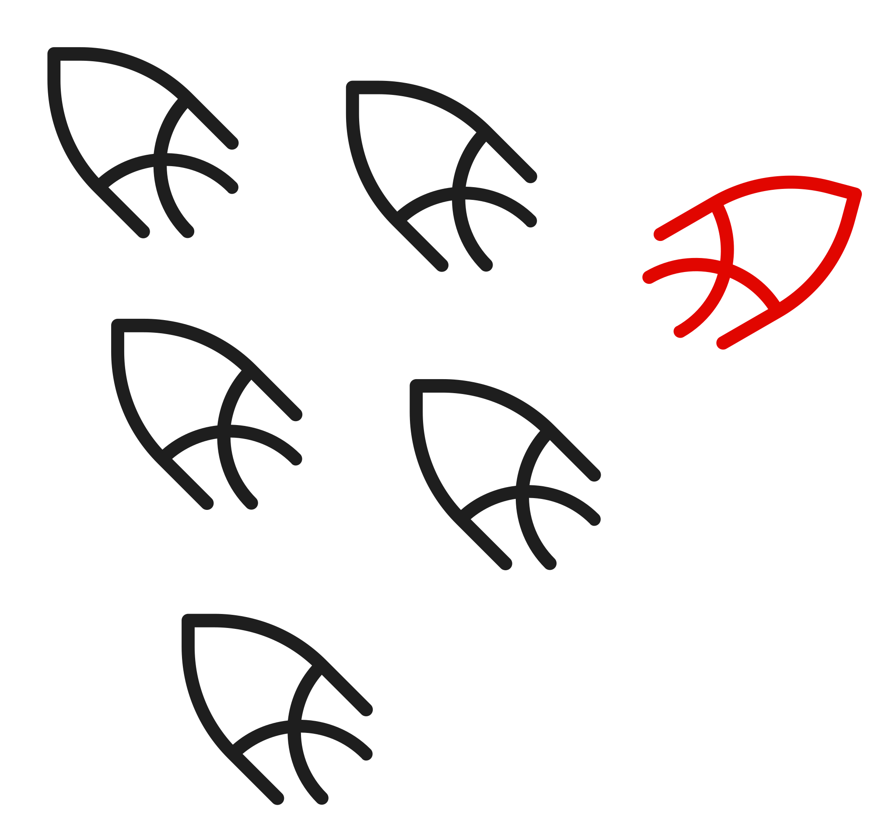
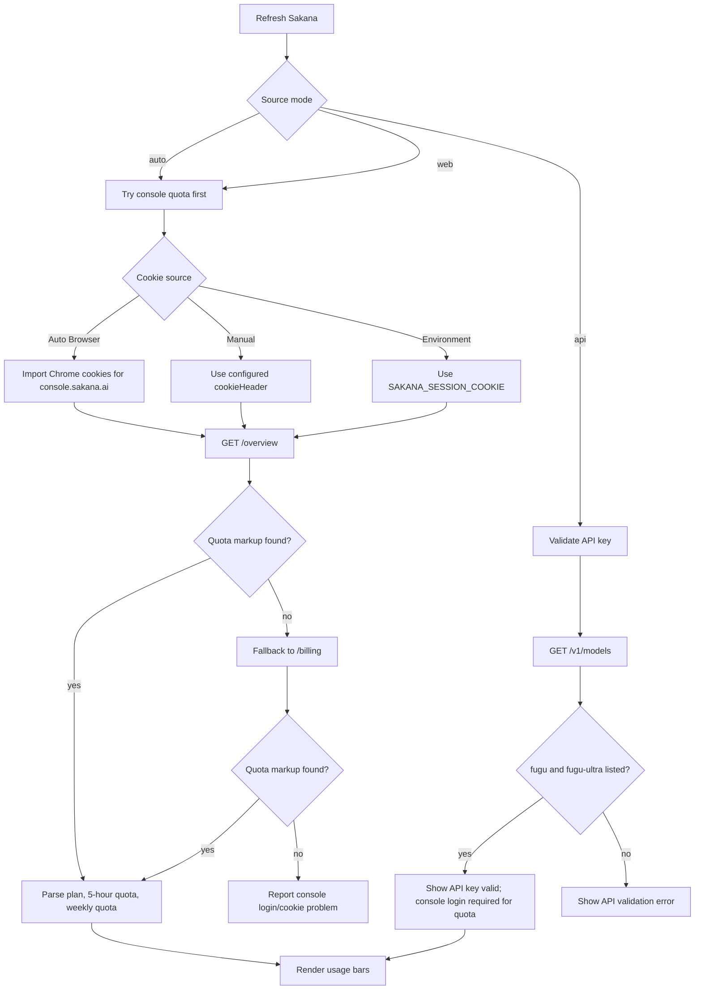

# Sakana AI

This fork adds a CodexBar provider for **Sakana AI** under the CLI/provider id `sakana`.
It combines two data sources:

- **Sakana API key**: validates API access and model availability through `GET https://api.sakana.ai/v1/models`.
- **Sakana console session**: reads plan-level quota from `https://console.sakana.ai/billing` or `/overview`.

The API key proves that model access is available. The console session is required for quota remaining, because the
quota data is rendered in the logged-in console rather than returned by the public model API.

<p>
  
</p>

## What It Shows

CodexBar maps Sakana usage into the same model used by the other providers:

| CodexBar field | Sakana source | Notes |
| --- | --- | --- |
| Provider id | `sakana` | Used by config, CLI, and settings. |
| Display name | `Sakana AI` | Visible in Settings and menus. |
| Identity / plan | Sakana console plan name | Falls back to `Sakana API key valid` when only API access is available. |
| Primary window | `5-hour quota` | Plan-level quota window. |
| Secondary window | `Weekly quota` | Plan-level quota window. |
| Model metadata | `fugu`, `fugu-ultra` | Confirmed through `/v1/models`; quota is treated as shared plan-level quota. |
| Cost history | Not supported yet | Sakana token cost estimation can be added later. |

## Setup

Enable Sakana in `~/.codexbar/config.json` or through Settings -> Providers -> Sakana AI.
Use placeholders in documentation and commits. Do not commit real credentials.

```json
{
  "version": 1,
  "providers": [
    {
      "id": "sakana",
      "enabled": true,
      "apiKey": "<your-sakana-api-key>",
      "cookieSource": "auto"
    }
  ]
}
```

Supported environment variables:

| Variable | Purpose |
| --- | --- |
| `SAKANA_API_KEY` | API key fallback when config does not contain `apiKey`. |
| `SAKANA_SESSION_COOKIE` | Manual console cookie fallback when browser import is unavailable. |
| `SAKANA_API_URL` | Optional API base URL override. Defaults to `https://api.sakana.ai`. |
| `SAKANA_CONSOLE_URL` | Optional console base URL override. Defaults to `https://console.sakana.ai`. |

## Source Modes



## Request Flow

```mermaid
sequenceDiagram
    participant UI as CodexBar UI
    participant Provider as Sakana provider
    participant Cookies as Browser cookie importer
    participant Console as Sakana console
    participant API as Sakana API

    UI->>Provider: Refresh sakana
    Provider->>Cookies: Import console.sakana.ai cookies
    Cookies-->>Provider: Cookie header or nil
    alt Console cookie available
        Provider->>Console: GET /overview
        Console-->>Provider: Authenticated HTML
        Provider->>Console: GET /billing when overview lacks quota
        Console-->>Provider: Billing HTML with plan usage
        Provider-->>UI: 5-hour + weekly quota
    else No usable console cookie
        Provider->>API: GET /v1/models
        API-->>Provider: Model list
        Provider-->>UI: API key valid; console login required
    end
```

## Security And Privacy

The Sakana implementation follows the same security rules as the other CodexBar providers:

- Real API keys and cookies stay in local config, environment variables, browser storage, or Keychain-backed browser
  cookie decryption. They are not committed to the repository.
- Logs and docs should only use placeholders such as `<your-sakana-api-key>` or `<cookie-header>`.
- The provider does not make generation calls during refresh.
- API validation uses a read-only `GET /v1/models` request.
- Console quota fetches send only the cookie header needed for `console.sakana.ai`.
- Response bodies can contain account or billing details, so debug dumps must not be committed.

## Implementation Summary

Main files:

- `Sources/CodexBarCore/Providers/Sakana/SakanaSettingsReader.swift`
- `Sources/CodexBarCore/Providers/Sakana/SakanaUsageFetcher.swift`
- `Sources/CodexBarCore/Providers/Sakana/SakanaCookieImporter.swift`
- `Sources/CodexBarCore/Providers/Sakana/SakanaProviderDescriptor.swift`
- `Sources/CodexBar/Providers/Sakana/SakanaSettingsStore.swift`
- `Sources/CodexBar/Providers/Sakana/SakanaProviderImplementation.swift`
- `Sources/CodexBar/Resources/ProviderIcon-sakana.svg`
- `Tests/CodexBarTests/SakanaProviderTests.swift`

Important behavior:

- `auto` mode tries console quota first, then falls back to API validation.
- `web` mode reports a clear error if no valid console session can be used.
- `api` mode reports valid model access but does not fake quota values.
- Logged-in console pages can contain generic login/auth strings in scripts, so parsing checks for quota content before
  treating a response as a login page.
- Weekly quota parsing reads forward from the `Weekly` label so it does not accidentally reuse the 5-hour percentage.
- Sakana uses the official SVG logo and is rendered as a colored image rather than a monochrome template mask.

## Verification

Useful local checks:

```bash
swift build --target CodexBarCore
swift build --target CodexBar
swift build --product CodexBarCLI
codexbar usage --provider sakana --source api --format json --pretty
codexbar usage --provider sakana --source web --format json --pretty
./Scripts/lint.sh format
```

Expected behavior:

- API mode should validate `fugu` and `fugu-ultra`.
- Web mode should show the plan name, 5-hour quota, and weekly quota when the browser is logged in to the Sakana console.
- Auto mode should prefer web quota and fall back to API validation when console cookies are unavailable.
